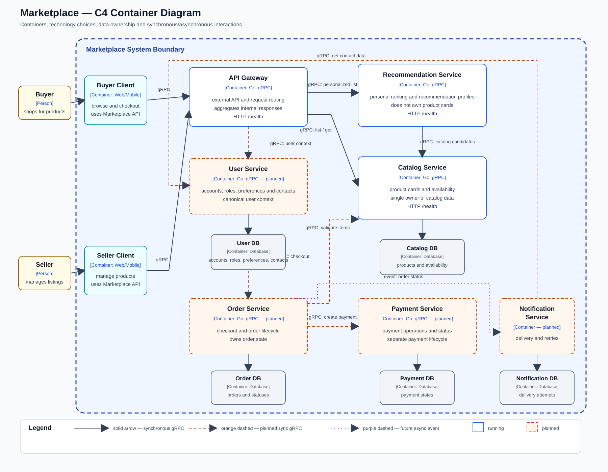

# Архитектура маркетплейса

## C4 Container diagram



Диаграмма показывает целевую архитектуру маркетплейса и реализованный
рабочий срез. В Compose сейчас запускаются `API Gateway`, `Recommendation
Service` и `Catalog Service`. Остальные доменные сервисы показаны как
следующие этапы развития системы.

`Buyer` и `Seller` — внешние пользователи. Их Web/Mobile-клиенты показаны
внутри границы Marketplace как клиентские контейнеры системы.

## Текущие потоки запросов

Для обычного списка без `user_id` Gateway обращается непосредственно к
каталогу:

```text
Client
  |
  | gRPC :50052
  v
API Gateway
  |
  | gRPC :50051
  v
Catalog Service
```

Для персонализированного списка используется выбранная цепочка:

```text
Client
  |
  | gRPC :50052
  v
API Gateway
  |
  | gRPC :50053
  v
Recommendation Service
  |
  | gRPC :50051
  v
Catalog Service
```

`API Gateway` — внешняя точка входа. Он принимает контракт из
`proto/marketplace.proto`. Если в запросе есть `user_id`, Gateway передаёт
его и строку поиска в `Recommendation Service`. В целевой архитектуре
Gateway также получает явные предпочтения пользователя из `User Service` и
передаёт пользовательский контекст в Recommendation Service. Recommendation
Service получает кандидатов у `Catalog Service`, применяет своё ранжирование
и возвращает Gateway выбранные карточки по `proto/catalog.proto`.

`Catalog Service` остаётся единственным владельцем карточек товаров.
Recommendation Service не владеет карточками: он использует их для выдачи,
но хранит только профили и данные ранжирования. Поэтому персональная логика
может меняться независимо от каталога.

## Домены

| Домен | Ответственность | Сервис-владелец |
|---|---|---|
| Users | Покупатели, продавцы и роли | User Service |
| Catalog | Товары и доступность позиций | Catalog Service |
| Personalization | Персональная выдача и ранжирование | Recommendation Service |
| Orders | Оформление заказов и их статусы | Order Service |
| Payments | Расчёт и учёт платежей | Payment Service |
| Notifications | Доставка уведомлений о статусах | Notification Service |

## Контейнеры и границы данных

| Контейнер | Ответственность | Данные во владении |
|---|---|---|
| API Gateway | Маршрутизация внешних запросов и агрегация ответов | Не владеет бизнес-данными |
| Catalog Service | Управление каталогом и выдача карточек товаров | Товары, описания и состояние каталога |
| Recommendation Service | Построение персонального порядка товаров | Производные профили, признаки и данные ранжирования; не карточки товаров |
| User Service | Пользователи, продавцы, предпочтения и контакты | Учётные записи, роли, выбранные категории интересов и канонические контакты |
| Order Service | Оформление заказов | Заказы и их статусы |
| Payment Service | Расчёт и учёт платежей | Платёжные операции и их статусы |
| Notification Service | Отправка уведомлений и повторные попытки | Попытки доставки и их статусы; не владеет контактами пользователей |

У каждого доменного сервиса — собственное хранилище. Общая база между
сервисами не используется. В рабочем срезе хранилища не подключены, потому
что задание требует поднять сервисы и их контракты, а не реализовывать
бизнес-функциональность.

### Почему выбраны такие границы

- `User Service` отделён, потому что учётные записи, роли, явные предпочтения и
  контакты нужны нескольким доменам, но должны иметь одного владельца.
- `Catalog Service` отделён от заказов: каталог обслуживает частые чтения
  ленты и управляет товарами, а заказ фиксирует отдельный снимок состава.
- `Recommendation Service` отделён от каталога из-за самостоятельного
  жизненного цикла моделей и возможности независимо масштабировать расчёт
  персональной ленты. Он хранит производные признаки и ранжирование, но не
  становится владельцем карточек товаров.
- `Order Service` и `Payment Service` разделены: у заказа и платежа разные
  состояния, ошибки и правила повторных операций.
- `Notification Service` отделён, потому что доставка имеет собственные
  попытки, ошибки и повторы и не должна владеть заказом.

### Принятое решение по персонализации

`User Service` хранит явные предпочтения пользователя — например, выбранные
категории интересов. `Recommendation Service` хранит производный профиль и
признаки ранжирования, которые могут строиться на основе предпочтений,
просмотров и заказов. `Catalog Service` остаётся владельцем карточек и
возвращает товары-кандидаты.

Для пользователя с предпочтениями Recommendation Service поднимает в выдаче
подходящие категории. Новый пользователь без предпочтений получает общий
порядок товаров. Реализация алгоритма и сбор событий в этой домашке не
требуются: текущий сервисный срез содержит только контракты и заглушки.

## Взаимодействие

| Источник | Получатель | Назначение | Способ |
|---|---|---|---|
| Client | API Gateway | Внешний API списка и карточки товара | Синхронный gRPC |
| API Gateway | Catalog Service | Общий список и карточка товара | Синхронный gRPC |
| API Gateway | Recommendation Service | Получить порядок товаров для пользователя | Синхронный gRPC |
| API Gateway | User Service | Получить явные предпочтения пользователя | Планируемый синхронный gRPC |
| Recommendation Service | Catalog Service | Получить кандидатов для персональной выдачи | Синхронный gRPC |
| Order Service | Catalog Service | Проверить актуальность позиций при оформлении | Синхронный gRPC |
| Order Service | Payment Service | Создать и проверить платёж | Синхронный gRPC |
| Order Service | Notification Service | Передать событие изменения статуса | Асинхронное событие в будущем |
| Notification Service | User Service | Получить актуальные контакты для доставки | Планируемый синхронный gRPC |

`Order Service` хранит состав и зафиксированные условия оформленного заказа.
`Catalog Service` остаётся владельцем актуальных карточек. `Payment Service`
хранит операции и их состояния. После получения результата платежа `Order
Service` фиксирует собственный статус заказа и публикует событие для
`Notification Service`. Событие содержит `order_id`, `user_id` и новый статус,
но не дублирует email, телефон или push-токен. Notification Service получает
актуальные контакты через User Service. Если User Service временно недоступен,
уведомление остаётся в очереди и повторяется позже. Для уведомлений выбран
асинхронный вариант: ошибка доставки не требует отката уже созданного заказа.

Все межсервисные вызовы в реализованном срезе — синхронный gRPC. `/health`
в каждом контейнере — отдельный HTTP endpoint для Docker health-check.
На диаграмме оранжевый пунктир означает планируемый синхронный gRPC, а
фиолетовый пунктир — планируемое асинхронное событие.

## Запуск

Требуется запущенный Docker Desktop.

```bash
docker compose up --build -d
docker compose ps
```

Проверка health-check Gateway:

```bash
curl -i http://localhost:8080/health
```

Остановить сервисы:

```bash
docker compose down
```

Порты:

| Порт | Назначение |
|---|---|
| 8080 | HTTP health-check API Gateway |
| 50052 | Внешний gRPC API Gateway |
| 50051 | Внутренний gRPC Catalog Service |
| 50053 | Внутренний gRPC Recommendation Service |

Порты `Catalog Service` и `Recommendation Service` не публикуются на
host-машину. Они доступны Gateway внутри Docker-сети.

## Генерация Go-кода

Готовый сгенерированный код уже включён в репозиторий, поэтому для запуска
через Docker генерация не требуется. Для повторной генерации нужны `protoc`,
`protoc-gen-go` и `protoc-gen-go-grpc`.

Из корня проекта:

```bash
mkdir -p gen/catalog gen/marketplace gen/recommendation

protoc \
  --proto_path=proto \
  --go_out=gen/catalog \
  --go_opt=paths=source_relative \
  --go-grpc_out=gen/catalog \
  --go-grpc_opt=paths=source_relative \
  catalog.proto

protoc \
  --proto_path=proto \
  --go_out=gen/marketplace \
  --go_opt=paths=source_relative \
  --go-grpc_out=gen/marketplace \
  --go-grpc_opt=paths=source_relative \
  marketplace.proto

protoc \
  --proto_path=proto \
  --go_out=gen/recommendation \
  --go_opt=paths=source_relative \
  --go-grpc_out=gen/recommendation \
  --go-grpc_opt=paths=source_relative \
  recommendation.proto
```

Проверка Go-кода:

```bash
go test ./...
```

## Варианты декомпозиции

### Вариант 1: модульный монолит

Все домены находятся в одном приложении и используют одну базу данных.

Плюсы:

- проще запускать и отлаживать;
- меньше сетевых взаимодействий;
- изменения заказа и платежа проще согласовать одной транзакцией.

Минусы:

- каталог, платежи и уведомления нельзя независимо масштабировать;
- общий релиз связывает изменения всех доменов;
- общая база повышает риск связанности схем и владельцев данных.

### Вариант 2: доменные сервисы за API Gateway

Каждый домен выделен в отдельный сервис со своей базой данных, а клиент
работает через единый Gateway. В выбранной реализации Catalog и
Recommendation — разные сервисы, потому что персонализация имеет отдельный
жизненный цикл и нагрузку. User, Order, Payment и Notification также имеют
собственные границы, хотя их контейнеры пока не реализованы.

Плюсы:

- каталог можно масштабировать под чтение ленты независимо от платежей;
- модель рекомендаций можно развивать и разворачивать отдельно;
- явны владельцы данных и контракты между доменами.

Минусы:

- персонализированный запрос проходит несколько сетевых hops и может
  завершиться ошибкой при недоступности одного из сервисов;
- частичный успех требует таймаутов, повторов и идемпотентности;
- больше Docker-конфигурации, мониторинга и координации контрактов.

## Финальный выбор

Выбран вариант с доменными сервисами и API Gateway, а персонализация
выделена в отдельный `Recommendation Service`.

Это решение подходит при предположении, что каталог и персональная лента
будут развиваться и масштабироваться с разной нагрузкой. Оно также даёт
понятное владение: User Service хранит исходные предпочтения, Recommendation
Service строит производное ранжирование, Catalog Service владеет карточками,
а Gateway скрывает внутренние контракты от клиента.

Цена решения — дополнительный сетевой hop и необходимость обрабатывать
недоступность Recommendation или Catalog. Для учебного проекта этот trade-off
приемлем: он наглядно показывает границы доменов и не требует реализации
бизнес-логики.

## Структура проекта

```text
hw1/
├── README.md
├── TASK.md
├── TODO.md
├── c4_container_diagram.svg
├── compose.yaml
├── .dockerignore
├── go.mod
├── proto/
│   ├── marketplace.proto
│   ├── catalog.proto
│   └── recommendation.proto
├── gen/
│   ├── marketplace/
│   ├── catalog/
│   └── recommendation/
└── services/
    ├── api-gateway/
    │   ├── Dockerfile
    │   └── src/
    │       ├── main.go
    │       ├── grpc_service.go
    │       ├── grpc_service_test.go
    │       ├── catalog_client.go
    │       ├── recommendation_client.go
    │       └── http_health.go
    ├── catalog-service/
    │   ├── Dockerfile
    │   └── src/
    │       ├── main.go
    │       └── catalog_server.go
    └── recommendation-service/
        ├── Dockerfile
        └── src/
            ├── main.go
            ├── recommendation_server.go
            └── http_health.go
```
